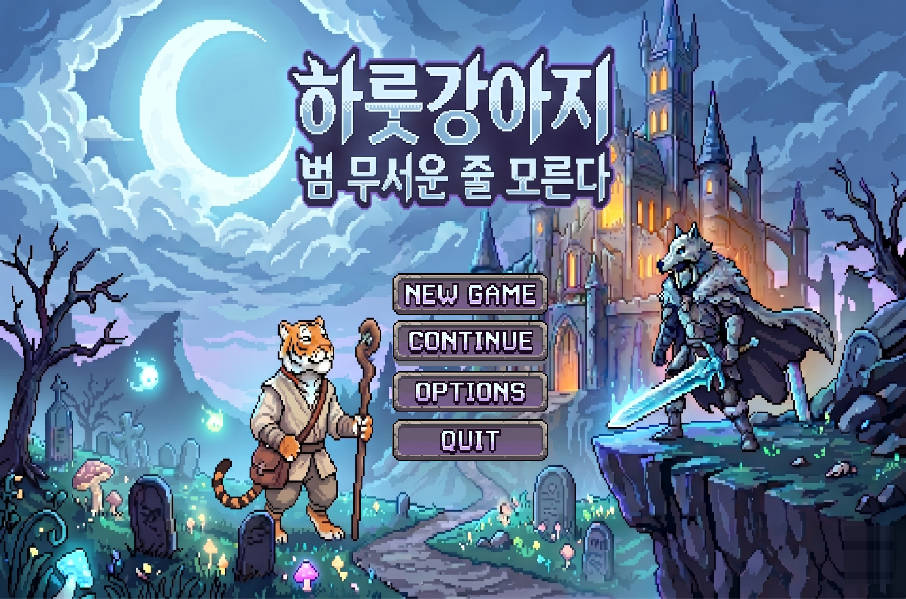

# 미니게임 프로젝트 — 2D 횡스크롤 로그라이크

Unity 6 기반 2D 횡스크롤 로그라이크 액션 게임.
모티브: **던그리드**, **스컬 더 히어로 슬레이어**

---

## 프로젝트 소개

- Unity 6(`6000.3.15f1`) 기반 **2D 횡스크롤 로그라이크 액션 게임**
- 개발 기간: **2026-05-15 ~ 2026-06-14 (약 4주)** · 이후 보완 2026-08-30 ~ 09-07
- 개발 인원: **1명 (개인 프로젝트)**

| | |
|---|---|
| **엔진 · 언어** | Unity 6000.3.15f1 / C# |
| **규모** | 스크립트 84개 / 약 12,700줄 |
| **콘텐츠** | 무기 10종 · 액세서리 21종 · 적 12종 · 미니보스 · 보스 |
| **던전** | 런당 10방 · 일반 방 프리팹 20종을 셔플 (+ 보스 · 미니보스 · 상점 · 튜토리얼 · 마을) |
| **메타 진행** | 골드 기반 영구 강화 8종 |

---

## 플레이 스크린샷 / 영상

### 타이틀 화면



`Title.prefab` — New Game / Continue / Options / Quit. 세이브가 없으면 Continue 는 비활성화됩니다.

*(인게임 스크린샷 삽입 예정)*

---

## 조작법

| 키 | 동작 |
|---|---|
| `←` `→` | 좌우 이동 |
| `↓` | 아래 방향 (하강 · 플랫폼 통과) |
| `SPACE` | 점프 (공중 점프 포함 최대 2회) |
| `Z` | 대쉬 (충전 2회 · 쿨다운 1초) |
| `X` | 공격 |
| `C` | 무기 전환 (2슬롯) |
| `TAB` | 인벤토리 |
| `A` | 상호작용 (NPC 대화 · 상자) |
| `ESC` | 일시정지 |

모든 키는 **옵션에서 재설정할 수 있습니다.** `InputManager` 가 저장된 키 설정을 읽어 `KeyCode` 로 변환하고,
각 시스템은 하드코딩된 키 대신 `InputManager.Instance?.Attack ?? KeyCode.X` 형태로 물어봅니다.
설정이 없으면 위 표의 기본값으로 떨어집니다.

---

## 주요 기능

### 게임 흐름

```
타이틀 → 튜토리얼 → 마을 ⇄ 던전(10방) → 보스 → 클리어
                      ↑                    │
                      └──── 사망 시 귀환 ────┘
```

- **런 단위 진행**: 던전 10개 방을 돌파. **4번 방은 상점, 7번 방은 미니보스, 10번 방은 보스.**
- **영구 죽음**: 사망 시 액세서리·무기를 잃고 마을로 귀환. 골드는 유지됩니다.
- **방 구성**: 사전 제작한 일반 방 20종을 Fisher-Yates 셔플해 순서를 세이브에 기록 → 컨티뉴 시 같은 배치가 복원됩니다.
  런 하나가 일반 방 7개를 소비하고, 셔플 목록이 바닥나면 다시 섞습니다.
- **방 진행**: `SpawnManager` 가 웨이브 단위로 스폰. 웨이브별 트리거 존을 지정하면 전멸 후 해당 구역 진입 시 다음 웨이브가 열립니다.
  방 클리어 → 보상 상자 + 포털 활성화.

### 전투 시스템

- **히트박스 / 허트박스 분리** — 적의 `MeleeHitbox` 는 활성화 1회당 1히트만 판정합니다.
- **플레이어 근접 판정은 박스** — 원형(`hitRadius`)이 아니라 몸통 앞으로 뻗는 사각형(`hitRange` 1.4 × `hitHeight` 1.9)입니다.
  원형은 키가 작은 적이 반경 밖으로 빠져나가 헛스윙이 났습니다.
- **판정 창(`hitWindow` 0.12초)** — 히트 프레임에서 1프레임만 검사하면 프레임 드랍에 판정이 통째로 사라집니다.
  창이 열린 동안 매 프레임 검사하되 `HashSet<int>` 로 스윙당 같은 적을 한 번만 때립니다.
- **입력 버퍼(`attackBufferTime` 0.16초)** — 쿨다운 중에 누른 공격을 기억했다가 쿨다운이 풀리는 즉시 발동합니다.
  버퍼가 없으면 연타 타이밍이 조금만 일러도 입력이 그대로 버려집니다.
- **데미지 단일 출처** — `EnemyController.damage` 가 근접·원거리 모두를 결정합니다. 밸런스를 만질 때 고칠 자리가 하나뿐입니다.
- **무기 3계열** — 근접 / 원거리 / 마법. `WeaponData`(ScriptableObject)로 정의하고 2슬롯 장착 후 `C` 로 전환합니다.
- **액세서리 21종**이 `StatBonus` 구조체로 합산되어 데미지 · 이속 · 점프력 · 대쉬 횟수/거리 · 흡혈 · 반사 · 관통 등에 반영됩니다.
- **연출과 판정 분리** — `attackDamageDelay` 로 공격 모션이 시작된 뒤 판정이 들어갑니다.
- 투사체는 `ObjectPool<T>` 로 재사용합니다.

### 지형 · 낙사

- **방 지형은 ASCII 레이아웃으로 정의합니다.** 에디터 도구 `MapLayoutTool`(`Assets/Editor/`)이 문자열 격자를 읽어
  방 프리팹의 타일맵에 지면(`#`)·발판·구덩이를 찍습니다. 손으로 칠하는 것보다 **재현·되돌리기가 쉽고,
  점프 사거리 대비 구덩이 폭을 수치로 검증**할 수 있습니다.
- **낙사는 즉사가 아닙니다** (`FallZone`). 던그리드 방식으로 **유효 최대 HP의 12%** 를 깎고
  마지막으로 밟고 있던 지점으로 되돌립니다. 카메라는 스냅 + 셰이크로 반응합니다.
- 낙하 기준선(`killY`)은 방 안 `Ground` 레이어 타일맵의 최하단에서 자동 계산되므로, 방마다 손으로 맞출 필요가 없습니다.
- 복귀 지점은 접지 상태일 때만 0.25초 간격으로 샘플링합니다. 스폰 직후 추락처럼 기록이 없으면 `PlayerSpawnPoint` 로 보냅니다.

### 편의 기능

| 기능 | 구현 |
|---|---|
| **미니맵** | `MinimapController` — 전용 카메라를 256×256 `RenderTexture` 에 렌더해 `RawImage` 로 출력, 플레이어 마커 표시 |
| **런 통계** | `RunStats` — 플레이 타임 · 처치 수 · 획득 골드 · 준/받은 피해 · 획득 아이템을 누적해 클리어/게임오버 화면에 표시 |
| **한국어 / 영어** | Unity Localization(`en`, `ko-KR`). `LocalizedLabel` · `AutoLocalizePanel` 로 패널이 ID만 들고 문자열은 테이블에서 받습니다 |
| **키 리바인딩** | `InputManager` — 모든 시스템이 하드코딩 대신 `InputManager` 에 키를 물어봅니다 |

### 적 AI

`EnemyController` 하나가 근접형과 원거리형을 함께 처리하고, 인스펙터 값으로 성격이 갈립니다.

| 항목 | 기본값 | 의도 |
|---|---:|---|
| `detectionRange` | 6 | 이 거리 안에 들어오면 순찰을 멈추고 추격 |
| `attackRange` | 1.2 | 공격 사거리 |
| `patrolDistance` | 4 | 스폰 지점 기준 왕복 순찰 폭 |
| `chaseYThreshold` | 1.2 | **높이 차가 크면 쫓지 않는다** — 아래층 플레이어를 향해 무작정 뛰어내리지 않게 |
| `edgeCheckDepth` | 1.5 | 발밑을 검사해 순찰 중 낭떠러지에서 떨어지지 않게 |
| `spawnDelay` | 2.5 | 스폰 직후 무행동 — 나오자마자 맞는 상황 방지 |
| `attackCooldown` | 1.2 | 공격 간격 |

- **원거리형**(`isRanged`)은 `safeDistance`(기본 3) 를 유지하며 물러서고, 쿨다운에 `rangedCooldownMultiplier`(1.8배)를 곱해 근접형보다 느리게 쏩니다.
  `aimAtPlayer` 를 켜면 플레이어를 조준하고, 끄면 정면으로 발사합니다.
- 피격 시 `knockbackForce` · `knockbackDuration` 으로 넉백. 처치 시 `potionDropChance`(20%) 로 회복 포션을 떨굽니다.
- **보스 패턴은 `BossController.Patterns` 로 분리** — 패턴을 추가해도 본체 상태 코드가 커지지 않습니다.

### 상점 · 성장 시스템

두 갈래로 나눠, **런 안에서만 유효한 성장**과 **런을 넘어 남는 성장**을 구분했습니다.

| | 위치 | 대상 | 지속 |
|---|---|---|---|
| **상점** | 던전 4번 방 | 무기 · 액세서리 · 소모품 | 런 종료 시 소멸 |
| **강화 NPC** | 마을 | 영구 강화 8종 | 영구 |

- 영구 강화 8종: 최대 HP · 공격력 · 치명타 · 이동속도 · 골드 획득 · 포션 드랍 · 보스 데미지 · 1회 부활.
- 아이템 이름·설명은 **스트링 테이블**로 빼, 패널이 ID만 받아 그립니다.

### 최적화

| 항목 | 내용 |
|---|---|
| **오브젝트 풀** | 투사체를 `ObjectPool<T>` 로 재사용 — 플레이어 · 일반 적 · 미니보스 · 보스 7개 스크립트가 공유합니다 |
| **전역 탐색 제거** | `FindObjectsByType` / `FindObjectOfType` 금지. `static List<T> Instances` 에 `OnEnable`/`OnDisable` 로 자기 등록·해제하고, 플레이어는 `PlayerRef` 정적 캐시로 참조합니다 |
| **도메인 리로드 대비** | 정적 상태를 쓰는 **39개 스크립트 전부에 `[RuntimeInitializeOnLoadMethod]` 리셋**을 뒀습니다. 리로드를 꺼도 이전 플레이의 값이 남지 않습니다 |
| **디스크 I/O 최소화** | 세이브에 더티 플래그를 두어, 골드 획득처럼 잦은 변경은 예약만 하고 실제 쓰기는 방 전환·종료 시 1회 |
| **로딩 제거** | 빌드 씬이 하나뿐이라 씬 로딩이 없습니다 (아래 [시스템 구조](#시스템-구조) 참고) |
| **비동기 정리** | UniTask + 모든 대기 루프에 `CancellationToken` 을 전달해 파괴된 오브젝트 접근을 막습니다 |

---

## 기술 스택

| 분류 | 사용 |
|---|---|
| **엔진 · 언어** | Unity 6000.3.15f1 · C# |
| **입력** | 레거시 Input + `InputManager` 키 리바인딩 레이어 |
| **데이터** | ScriptableObject (무기 / 액세서리 / 강화 설정 / 대사) |
| **로컬라이징** | Unity Localization 1.5.2 — 한국어 / 영어 스트링 테이블 |
| **비동기** | UniTask (`CancellationToken` 필수) |
| **저장** | `JsonUtility` + AES-256(CBC) + 원자적 파일 교체 |
| **풀링** | 자체 `ObjectPool<T>` |
| **에디터 도구** | `MapLayoutTool` — ASCII 레이아웃 → 타일맵 지형 생성 |
| **UI** | uGUI · TravelBook Lite 픽셀 UI 키트 |
| **아트** | 상용 픽셀 에셋 (별도 저장소로 분리) |

---

## 시스템 구조

```
Assets/
├── Scene/MainTest.unity   ← 유일한 빌드 씬 (부트스트랩)
├── Editor/MapLayoutTool.cs ← ASCII 레이아웃 → 타일맵 지형 생성 (에디터 전용)
├── Scripts/
│   ├── Player/            PlayerController, Movement, Combat, Weapon, Health, CameraFollow, FallZone
│   ├── Enemy/             EnemyController, BossController(+Patterns), MiniBoss, SpawnManager
│   ├── Items/             Inventory, TreasureChest, WorldGold/Potion
│   ├── Weapons/           WeaponData(SO), WeaponInventory
│   ├── Shop/              Shop, ShopUI, UpgradeShopUI
│   ├── Save/              SaveManager(AES), SaveData, MetaUpgrades, ItemDatabase
│   ├── NPC/               DialogueUI, NpcController
│   ├── UI/                GameFlowController, RoomManager, InputManager, TimeScaleLock,
│   │                      MinimapController, RunStats, 로컬라이징(L10n/LanguageManager)
│   └── ObjectPool.cs
├── Prefabs/               Player, Enemy, map(방 20 + 보스/미니보스/상점/튜토리얼/마을), Object, UI, NPC
├── Data/
│   ├── Weapons/ Accessories/  ScriptableObject (무기 / 액세서리 / 강화 설정)
│   └── Localization/          스트링 테이블 (en / ko-KR)
└── Animations/
```

### 씬이 하나뿐인 이유

`SceneManager.LoadScene` 을 쓰지 않습니다. `MainTest.unity` 는 매니저만 담긴 부트스트랩이고,
타이틀·마을·던전 방·튜토리얼은 전부 **프리팹을 런타임에 Instantiate/Destroy** 해서 전환합니다.

- 씬 로딩 끊김이 없어 페이드 전환이 매끄럽습니다.
- 플레이어·인벤토리·세이브가 씬 경계를 넘나들 필요가 없습니다.
- 흐름 제어는 `GameFlowController`(화면 전환)와 `RoomManager`(던전 방 진행)로 나뉩니다.

### 세이브 / 로드

- `JsonUtility` 직렬화 → **AES-256(CBC)** 암호화 → `Application.persistentDataPath/save.dat`
- **원자적 쓰기**: `.tmp` 에 먼저 쓰고 `File.Replace` 로 교체, 직전 버전은 `.bak` 로 보관.
  쓰기 도중 강제 종료돼도 한 판 전 상태로 복구됩니다.
- **더티 플래그**: 잦은 변경은 예약만 하고, 실제 디스크 쓰기는 방 전환·종료 시 1회.
- 구버전 IV 세이브 자동 마이그레이션.
- 던전 방 순서(`savedRoomOrder`)와 진행 커서까지 저장해 컨티뉴 시 같은 던전이 복원됩니다.

### 성능 / 안정성 규칙

- **`FindObjectsByType` / `FindObjectOfType` 금지.** 정적 리스트(`static List<T> Instances`)에
  `OnEnable`/`OnDisable` 로 자기 등록·해제하거나, `PlayerRef` 같은 정적 캐시를 사용합니다.
- 도메인 리로드를 꺼도 안전하도록 모든 정적 상태에 `[RuntimeInitializeOnLoadMethod]` 리셋을 둡니다.
- 비동기는 UniTask. 모든 루프에 `CancellationToken` 을 전달해 파괴된 오브젝트 접근을 막습니다.
- `Time.timeScale` 은 `TimeScaleLock` 한 곳에서만 씁니다(참조 카운트). 모달이 겹쳐도 어긋나지 않습니다.

---

## 트러블슈팅

### 1. 상점을 열어둔 채 게임이 진행되던 버그

일시정지·인벤토리·상점·강화·게임오버·클리어 **6개 시스템이 각자 `Time.timeScale` 에 0과 1을 대입**하고 있었습니다.
상점(`timeScale=0`)을 연 상태에서 강화 패널을 열었다 닫으면, 강화 패널이 자기 기준으로 `1f` 를 복원해
**상점 UI가 떠 있는데 뒤에서 적이 움직이는** 상태가 됐습니다.

→ `TimeScaleLock` 으로 소유권을 중앙화했습니다. 잠금을 쥔 주체가 하나라도 있으면 0, 전부 놓으면 1입니다.
파괴된 소유자는 `Apply()` 에서 걸러내 잠금이 영구히 남는 것을 막습니다.

### 2. 사망 모션이 한 프레임만 보이던 문제

`GameOverUI` 가 `IsDead` 를 감지한 **그 프레임에** `timeScale = 0` 을 걸었는데,
플레이어 Animator 의 `UpdateMode` 가 `Normal`(스케일 시간)이라 죽는 애니메이션이 시작하자마자 얼어붙었습니다.

→ 사망 감지와 정지 사이에 `deathAnimDuration` 만큼 간격을 두고, 그 뒤에 잠금을 겁니다.

### 3. 적이 아래층 플레이어를 향해 뛰어내리던 문제

추격 판정이 거리만 봤기 때문에, 플랫폼 위의 적이 아래에 있는 플레이어를 감지하면
그대로 낭떠러지로 걸어 나가 떨어졌습니다.

→ `chaseYThreshold`(높이 차 임계값)와 `edgeCheckDepth`(발밑 검사)를 넣었습니다.
높이 차가 크면 추격하지 않고, 순찰 중 발밑이 비면 방향을 되돌립니다.

### 4. 지형에 구덩이를 내자 게임이 진행 불가가 되던 문제

방을 평지에서 플랫포머 지형으로 바꾸면서 구덩이를 넣었더니, 빠진 플레이어가 **무한히 낙하**했습니다.
바닥이 없으니 죽지도, 올라오지도 못하는 상태였습니다.

→ `FallZone` 을 방 프리팹 루트에 붙였습니다. 즉사시키는 대신 최대 HP의 12%를 깎고
마지막 접지 지점으로 되돌립니다. 기준선은 방 안 `Ground` 타일맵 최하단에서 자동 계산해
방마다 수동으로 맞출 필요를 없앴습니다.

### 5. 언어 전환 직후 터지던 `MissingReferenceException`

`LanguageManager` 가 Unity Localization 초기화를 `await` 하는 동안, 대기 중이던 UI가 파괴되면
복귀 시점에 이미 없는 오브젝트를 건드렸습니다. 방 전환처럼 UI가 자주 갈아엎히는 구간에서 재현됐습니다.

→ 모든 대기에 `GetCancellationTokenOnDestroy()` 를 넘겼습니다.
오브젝트가 파괴되면 `await` 가 그 자리에서 취소되고 이후 코드가 실행되지 않습니다.
이 규칙은 프로젝트 전체 비동기 코드에 동일하게 적용했습니다.

---

## 실행 방법

1. Unity **6000.3.15f1** 로 프로젝트를 엽니다.
2. 아래 **아트 에셋**을 받아 `Assets/Imported/` 에 넣습니다.
3. `Assets/Scene/MainTest.unity` 를 열고 재생합니다. (빌드 대상 씬도 이것 하나입니다)

### ⚠️ 아트 에셋은 이 저장소에 포함되어 있지 않습니다

`Assets/Imported/` 는 `.gitignore` 로 제외되어 **별도 저장소**에서 관리합니다.

> **에셋 저장소**: https://github.com/Devel-Rocket-ClassRoom/minigame-project-assets-suk558165
> (저장소 최상위의 `Imported/` 가 이 프로젝트의 `Assets/Imported/` 에 대응합니다)

`Assets/Prefabs/Enemy/` 와 `Assets/Animations/` 가 이 폴더의 스프라이트를 참조하므로,
**에셋 저장소를 받지 않으면 스프라이트가 깨진 채로 실행됩니다.**

```bash
git clone https://github.com/Devel-Rocket-ClassRoom/minigame-project-assets-suk558165.git /tmp/assets
cp -r /tmp/assets/Imported Assets/
```

에셋을 수정했다면 **메인 저장소가 아니라 에셋 저장소에 커밋·푸시**해야 합니다.
텍스처 임포트 설정(`.meta`)도 거기 들어있습니다.

포함된 폴더 (괄호 안은 프리팹·애니메이션이 실제로 참조하는 파일 수):

| 폴더 | 용도 |
|---|---|
| `sanctum_pixel/14_big_monster_bundle` | 적 12종 + 보스 스프라이트 / 애니메이션 |
| `Falete` (60) | 맵 타일셋 · 배경 · 성 오브젝트 |
| `Free - Raven Fantasy Icons 1` (33) | 무기 · 액세서리 아이콘 |
| `Audio` (21) | BGM · 효과음 |
| `Object` (14) | 상자 · 골드 · 포션 · 투사체 |
| `Inventory` (7) | 인벤토리 UI 스프라이트 |
| `Player` (6) | 플레이어 스프라이트 |
| `Ground2` (5) / `Ground` (1) | 지형 타일 |
| `NPC` (5) | 마을 NPC |
| `Font` (2) | 폰트 |
| `Title` (2) | 타이틀 화면 |
| `Portal` (1) | 포털 |

`2D Platformer Enemy Pack`, `2D SD Monster Pack`, `Apk` 는 임포트만 되어 있고
현재 참조하는 자산이 하나도 없습니다(초기 프로토타입 잔재).

### 텍스처 임포트 설정

에셋 저장소에서 받으면 `.meta` 의 아래 설정이 함께 따라옵니다.
에셋스토어에서 **새로 임포트할 때만** 직접 맞춰주세요 — 기본값이면 픽셀아트가 흐릿해집니다.

| 설정 | 값 | 이유 |
|---|---|---|
| Filter Mode | **Point (no filter)** | Bilinear 이면 픽셀아트가 흐려짐 |
| Compression | **None** | 작은 픽셀 스프라이트에 압축 아티팩트가 낌 |
| Generate Mip Maps | 끔 | UI에 불필요 |

UI 스프라이트의 9-slice 테두리 값은 `.meta` 에 들어 있으므로 별도 설정이 필요 없습니다.
